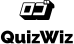

<div style="display:flex; align-items: center">
  
  <h1 style="position:relative; top: -6px" >quizwiz: The Quiz Bank API</h1>
</div>

---

quizwiz is an API designed to find and complete quizzes to test your knowledge and limitations.

#
### Table of Contents
* [Prerequisites](#prerequisites)
* [Tech Stack](#tech-stack)
* [Getting Started](#getting-started)
* [Migrations](#migration)
* [Development](#development)
* [Database Design Diagram](#database-design-diagram)
* [API Documentation](#api-documentation)


#
### Prerequisites

* *PHP@8.2*
* *MYSQL@8.0.36*
* *composer@2.7.1*
* *npm@10.2.3*

#
### Tech Stack

* [Laravel@11.x](https://laravel.com/docs/11.x) - back-end framework
* [Laravel Nova@4.0](https://nova.laravel.com/docs/installation.html) - package for admin panel
* [Laravel Sanctum@4.0](https://laravel.com/docs/11.x/sanctum) - package for API authentication


#
### Getting Started

1. Clone the repository
   ```sh
   git clone https://github.com/RedberryInternship/quizwiz-back-luka-trapaidze.git
   ```
   
2. Next step requires you to run *composer install* in order to install all the dependencies.
    ```sh
    composer install
    ```
   
3. Now we need to set our env file. Go to the root of your project and execute this command.
   ```sh
   cp .env.example .env
   ```
   
4. And now you should provide **.env** file all the necessary environment variables:


####
**MYSQL:**
>DB_CONNECTION=mysql

>DB_HOST=127.0.0.1

>DB_PORT=3306

>DB_DATABASE=*****

>DB_USERNAME=*****

>DB_PASSWORD=*****

####
**FILESYSTEM:**
>FILESYSTEM_DISK=public

####
**MAIL:**
>MAIL_MAILER=smtp

>MAIL_HOST=...

>MAIL_PORT=...

>MAIL_USERNAME=...

>MAIL_PASSWORD=*****

>MAIL_ENCRYPTION=...

>MAIL_FROM_ADDRESS=...


####
**Nova (optional):**
>NOVA_PATH=...

>NOVA_LICENSE_KEY=*****

####
**Sanctum:**
>SANCTUM_STATEFUL_DOMAINS=...

>SESSION_DOMAIN=...

after setting up **.env** file, execute:
```sh
php artisan config:cache
```
in order to cache environment variables.

Now execute in the root of you project following:
 ```sh
php artisan key:generate
 ```
Which generates auth key.

##### Now, you should be good to go!


#
### Migration
if you've completed getting started section, then migrating database if fairly simple process, just execute:
```sh
php artisan migrate
```


#
### Development

You can run Laravel's built-in development server by executing:

```sh
php artisan serve
```


#
### Database Design Diagram


[Database Design Diagram](https://drawsql.app/teams/solo-176/diagrams/quizzwiz "drawsql.app")


#

### API Documentation

[API Documentation](https://documenter.getpostman.com/view/33136231/2sA3BuVoDa#5476b041-b8fd-4766-abd8-91d09c76dd45 "Postman")